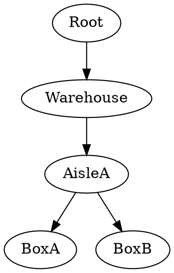
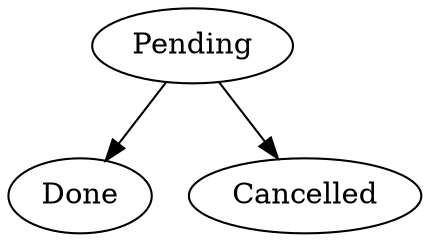

# Inventory structure

Inventory holds the representation of your warehouse. Its purpose is to locate, track and help moving products around.

In order to do so, we define a few objects. Note that in order to differentiate common english name from these notions, we use a uppercase first letter (Product instead of product).

**User** is someone using Rocki. We often use the pair User + date to track actions. We'll abbreviate this by U+D.

**Product** is a type of thing in your warehouse. May be a specific size of bolts, shirts identified by a given SKU, a type of liquid you trade and so on.

*example : M3x12mm, 34-123-XXL, water*

**Batch** is a given quantity of Product. It is also referred sometimes as a Lot in the industry.

*example : 3 bolts M3x12mm, 4 shirts, 2L of water*

**Location** is a physical place that can hold other Locations, or a set of Batches. Yes one place can be inside another. Locations are organized as a tree graph.

**Operation** is a change of the Location tree composition or organisation. Put simply, it's anything that moves ProductQuantities or Locations around.

### Operation lifecycle

Some important things about Operations:

- Operation have a status, that can be "Pending" (just created), "Done" or "Cancelled". There's no other status.

- Every change is tracked by an Operation. There's no "shadow" Operation.

This guarantees that Inventory can backtrack at any point back in time.

- An Operation has at least a target Location or a source Location.
- It has a finite life time.

In order to maintain speed in Silo, the Operations get archived after a given amount of time, that we call the "Data Horizon".
 
**Data Horizon** is of **1 year**.

Note that for the same reason, when a Location meets the following criterias:

- No child left
- Empty
- No pending operation that targets/sources it

Then it gets archived as well.
